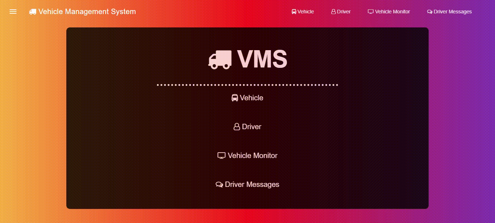
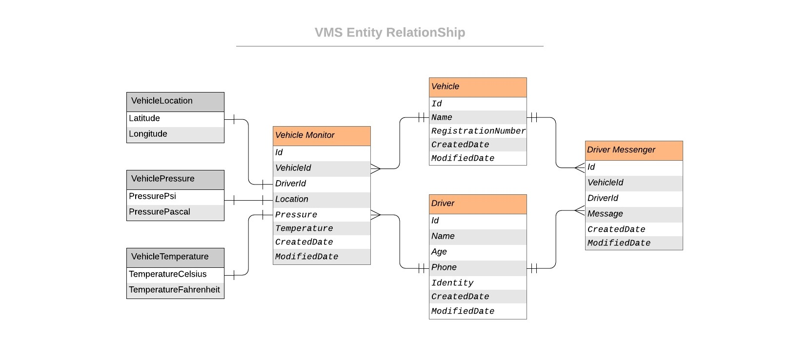
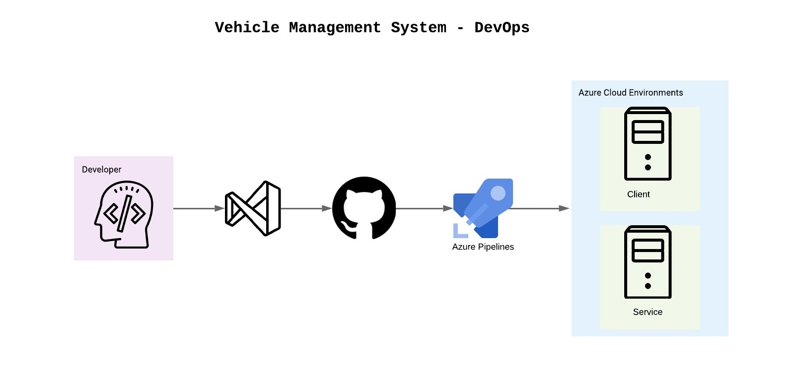

# Vehicle Management System Client

Vehicle Management System Client that allows the user to create, update and delete vehicles and it's tracking related entities from it.

[](https://dev.azure.com/iavivarma/VehicleManagementSystem/_build/latest?definitionId=4&branchName=master)
[](https://dev.azure.com/iavivarma/VehicleManagementSystem/_release?view=all&_a=releases&definitionId=3)
[](https://vehiclemanagementsystemclient.azurewebsites.net/)
[](https://vehiclemanagementsystemclient.web.app/)

## Client - Web Interface Guide

### View and Add Vehicle


### View and Add Driver


### View and Add Vehicle Monitor Data



### View and Add Driver Message


## Entity Relationship



## DevOps Flow



## Run Dev Environment

```bash
$ npm install
$ npm start
```

## Run Prod Environment - Static Server

```bash
$ npm install -g serve
$ npm run build
$ server -s build 
```

## Firebase

### Firebase Configuration

```bash
$ npm install firebase-tools -g
$ firebase login
$ firebase init
```

### Firebase Deployment

```bash
$ npm install
$ npm run build
$ firebase deploy
```